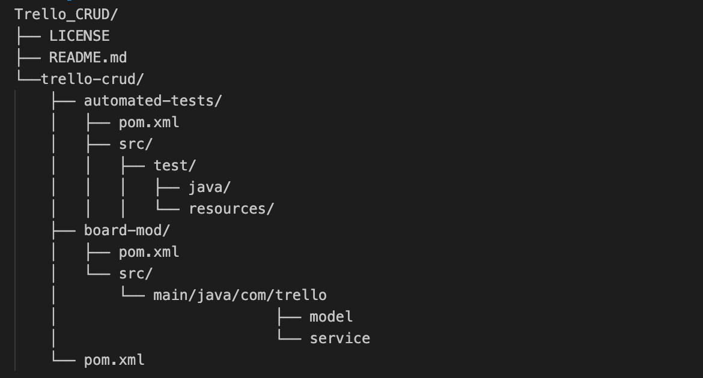

# Trello CRUD Project

This project is a Maven-based Java application for managing Trello boards. It includes modules for board modifications and automated tests.

## Table of Contents

1. [Project Structure](#project-structure)
2. [Scope and Implementation](#scope-and-implementation)
3. [Prerequisites](#prerequisites)
4. [Building the Project](#building-the-project)
5. [Running the Application](#running-the-application)
6. [Running Tests](#running-tests)
7. [License](#license)

## Project Structure


## Scope and Implementation:
Project scope is CRUD operations for Trello Board, including automated Cucumber tests for backend API and automated UI tests.

The project contains 2 modules, namely, [board-mod](trello-crud/board-mod) and [automated-tests](trello-crud/automated-tests).
  - ***board-mod***: This module provides a [trello board model](trello-crud/board-mod/src/main/java/com/trello/model/Board.java) with board fields: 'name', 'idOrganization', and 'url', and has a json parser that creates a Board object from retrieved json response to API requests.
  The second part of this module is the [trello board service](trello-crud/board-mod/src/main/java/com/trello/service/TrelloBoardServiceInterface.java) that provides the CRUD operations implementation.

  - ***automated-tests***: This module provides automated positive and negative API backend [Cucumber tests](trello-crud/automated-tests/src/test/resources/com/trello/service/TrelloBoardScenarios.feature) that are implemented in [service folder](trello-crud/automated-tests/src/test/java/com/trello/service) that provides [step definitions](trello-crud/automated-tests/src/test/java/com/trello/service/TrelloBoardServiceSteps.java) and [Cucumber test runner](trello-crud/automated-tests/src/test/java/com/trello/service/RunCucumberTest.java).
  It also provides automated [UI test](trello-crud/automated-tests/src/test/java/com/trello/ui/TrelloBoardUITests.java) using Selenium and Safari Webdriver.
      - ***Note***:
      For the tests to run, a valid Trello (valid email and password and valid API_KEY and API_Token) account is needed:
          1. At https://github.com/MoEbada/Trello-CRUD/blob/main/trello-crud/automated-tests/src/test/java/com/trello/service/TrelloBoardServiceSteps.java#L20, replace with valid API_KEY and API_TOKEN
      
          2. At https://github.com/MoEbada/Trello-CRUD/blob/main/trello-crud/automated-tests/src/test/java/com/trello/ui/TrelloBoardUITests.java#L19, replace with valid API_KEY and API_TOKEN

          3. At https://github.com/MoEbada/Trello-CRUD/blob/main/trello-crud/automated-tests/src/test/java/com/trello/ui/TrelloBoardUITests.java#L72 and https://github.com/MoEbada/Trello-CRUD/blob/main/trello-crud/automated-tests/src/test/java/com/trello/ui/TrelloBoardUITests.java#L75, replace with a valid trello email and password

          4. [TrelloBoardUITests.java](trello-crud/automated-tests/src/test/java/com/trello/ui/TrelloBoardUITests.java) provides an automated UI test using Selenium and Safari webdriver. In order to make the test runnable make sure you install the Safari webdriver, or if you would like to use another webdriver make sure to update [BaseTest.java](trello-crud/automated-tests/src/test/java/com/trello/ui/BaseTest.java) on lines:
              ```
              import org.openqa.selenium.safari.SafariDriver;
              ```
              at https://github.com/MoEbada/Trello-CRUD/blob/main/trello-crud/automated-tests/src/test/java/com/trello/ui/BaseTest.java#L6
              and
              ```
              driver = new SafariDriver();
              ```
              at https://github.com/MoEbada/Trello-CRUD/blob/main/trello-crud/automated-tests/src/test/java/com/trello/ui/BaseTest.java#L13


## Prerequisites

- Java 11 or higher
- Maven 3.8.4 or higher
- Docker (optional, for containerization)

## Building the Project

To build the project, navigate to the [`trello-crud`] directory and run:

```sh
mvn clean package
```
This will compile the source code and package it into a JAR file.

## Running the Application
To run the application, navigate to the trello-crud/board-mod directory and execute:
```sh
java -jar target/board-mod-1.0-SNAPSHOT.jar
```

## Running Tests
To run the tests, navigate to the trello-crud directory and execute:

```sh
mvn test
```
This will run all the tests in the automated-tests module.

To generate HTML test report, run:
```sh
mvn site -DgenerateReports=false
mvn surefire-report:report
```
Test report should be gnerated under automated-tests/target/surefire-report.

## License
This project is licensed under the MIT License. See the LICENSE file for details.